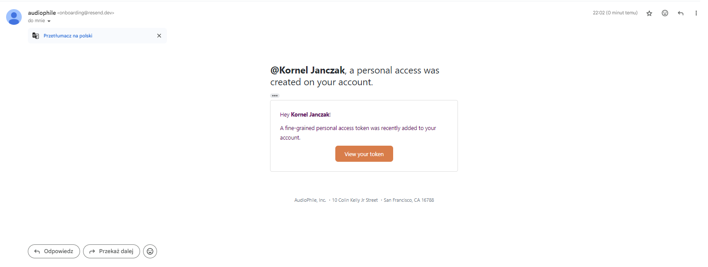
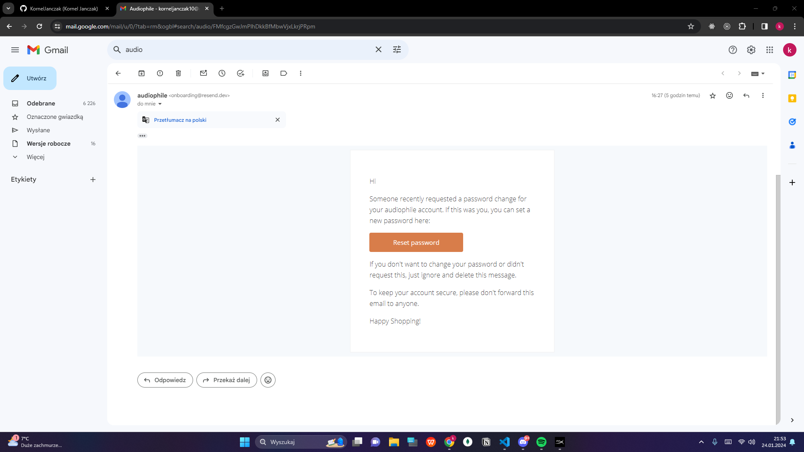
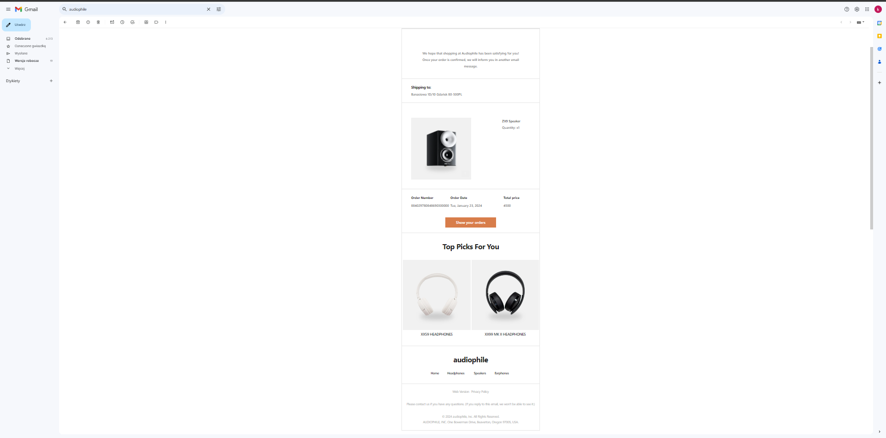

# Full Stack E-Commerce Audiophile website: Next.js 14(App Router), React, TypeScript, MongoDB

For DEMO, use [Stripe Testing Cards](https://stripe.com/docs/testing)

## IMPORTANT !!!

Unfortunately, the resend email function is not operational without a custom domain, so I have included screenshots with the emails

## Test account

- Login: test@example.com
- Password: Kw1234!

## Key Features

- Authorization using NextAuth (Google, Github, Email).
- Beautiful emails for signing up and after purchase.
- Stripe Checkout.
- Locally persisted shopping cart.
- You will be to see your orders.
- You will be able to change your password either when you are logged in or if you have forgotten it. 
- Animations using Framer motion.
- The functionality is written in TypeScript
- Responsive layout

## What could I do better?

- Utilizing Zod validation with server actions instead of using Tanstack Query, Formik, and Yup
- Should write simpler and less complex function for easier unit testing

## What I've learned

- In-depth exploration of Next.js functionalities.
- Implementation of authentication using NextAuth.
- Sending emails through Resend and React Email.
- Proficiency in working with MongoDB and Mongoose.
- Developing a straightforward backend using API Routes.
- Integration of Stripe with the website.

Part of design is from <a href="https://www.frontendmentor.io/challenges/product-feedback-app-wbvUYqjR6" target="_blank">Frontend mentor</a>

